### Accumulated Total Time: 48h

## May 31st: Initial Research & Component Selection

I began by re-reading the FIE (International Fencing Federation) documentation on the material requirements of each weapon and confirm details such as signaling information and the permitted resistances of each component. Because fencing has three main weapons, there are three different signaling protocols the device must be able to test. However, much of the physical connectors and pinouts is shared between weapons and as such I am hopeful that it will be possible to limit the need for separate testing hardware through use of a microcontroller to switch inputs, etc.

The function of testing equipment will be primarily served through measurement of resistance across components leading to a pass/fail result based on comparison to the standards. However, I also intend to add an option to select a weapon and then have weapon testing including hit detection and on/off target detection. This will require additional ports and can be self contained within the unit. Finally, I am also investigating the ability to send test signals to other score machines. Because voltages are not standardised between units, this would require implementation of a set of relays to close the connections from the external unit.

### Control Requirements

The unit will require a microcontroller to register the test inputs and generate sample outputs. This will likely be an esp32 derived controller selected further on once requirements are better established.

As there is intent to extend functionality to generating test signals for external equipment a series of relays will be required. This is because fencing computers do not all operate at a standard logic level for piste signals, with significant variation between devices. However, most devices use a voltage of around 0.75V to 1V so relays and other switching components can be designed around this low range - potentially using 3.3V rated components to provide a safe margin of error.

### Hardware interface

The hardware interfaces of the device are influenced by the definitions within the FIE technical documentation. This provides a unified system for connectors and pinouts across equipment globally.

Choices regarding the interfaces are centered around trying to provide as much functionality as possible, but will change over time as the project implementation evolves.

Interfaces that are likely required for the device include:

Weapon & Fencer Interfaces

- Body wire connector - 3 Pin Banana Plug (FIE)
- Eppe weapon connector - 3 Pin Banana Plug (FIE)
- Foil/sabre weapon connector - 2 Pin Banana Plug (FIE)
- Ground tab - strip of metal to attach lame clip

User Interfaces

- Weapon Selection
- Mode Cycle
- Screen - For output of test information & manual test feedback

External Box Test Interfaces

- 3 Pin Banana Plug (FIE) output port to test external hit machines

**Total time spent: 3h**

## June 1st: Research into individual weapon checks

I continued researching how to best implement the tests on individual weapons. The key requirements of this testing mode must include:

### Validation of resistance

While fairly simple, all equipment has specific resistance ratings that it must remain under to perform properly. If there is any increase in resistance due to rust or microscopic fractures, it can lead to the incorrect detection of a hit. This often manifests through weapons registering as off target in foil or false hits in eppe. By checking these factors, it is possible to diagnose a broken/worn out tip or a poor body wire connection (often stemming from collapsed plugs).

Required maximum resistances are:

- The body wire must have a resistance of 1 ohm
- The spool must have a resistance of 3 ohms
- Weapon resistance of 2 ohms
- Cable resistance of 2.5 ohms

### Hit registration

In order to test that weapons are wired correctly, it must be possible to check continuity between the wires going to the button. This allows verification that hits will register. For foil and sabre, it is also necessary to check continuity to the jacket of the opponent. This is because foil and sabre only register 'valid' hits on a specific section of the body and all other hits must be registered as a separate off-target signal.

Within documentation, each pin of the standard connector is only referred to by its distance from the centre. I will define pinout numbers for them to simplify the creation of documentation and schematics throughout this project.

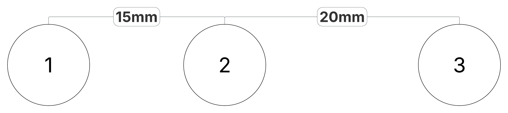

#### Pin Usage

| Weapon | Pin 1 | Pin 2 | Pin 3 |
| ------ | ----- | ----- | ----- |
| Foil   | Lame | Tip | Weapon/Piste |
| Eppe   | Direct Wire | Other Wire | Weapon/Piste |
| Sabre  | Lame | Tip | Weapon/Piste |

#### Hit detection

The criteria for registering a hit differ between weapons.

In foil and sabre, pins 2 & 3 must be closed on the weapon, and Pin 2 must be connected to the opponents pin 1 (Via the opponents conductive jacket). If pins 2 & 3 are closed but the circuit through the opponent's jacket is not completed it is counted as 'off-target'. In this case no point is awarded, but the bout must still be halted and so it must be detectable and displayed. Foil and sabre have all connections normally open.

In eppe pins 1 & 2 are normally closed, and a hit is registered when the connection is opened. Because eppe does not have a target area, Pin 3 is used to detect connection to the floor or opponents weapon. If the weapon hit the floor instead of the opponent, the hit will not register.

### Implementation of hit detection

Hit detection will be implemented with a single 3 pin connector attached to the body wire and weapon. By raising pin 2 to high and connecting pins 1 & 3 to input ports on the microcontroller, it is possible to check which circuits are complete and thus register a hit in testing. In order to have this adapt to the different weapons, a weapon select button will be required to change the logic between foil, eppe, and sabre.

In order to correctly identify target/vs off target for foil and eppe, it will be necessary to include a metal tab that simulates the connection to the lame.

### Implementation of resistance checking

Resistance checking is a key feature in troubleshooting. However, implementing it with minimal components is challenging. Because of this, I have decided to limit resistance checking to just the body wire. I believe this is reasonable to prevent score creep and because these are the most commonly troubleshooted components. Since this gives us a very small range of resistance, it will be simple to include a voltage divider that compares if the wire is over the set legal resistance value with a comparison resistor. Having a small range of resistances that are being tested also removes the key issue of using a voltage divider which is that they get increasingly inaccurate as you move away from the known comparison value.

### Implementation of test signal output

In order to test external equipment capable of running matches with precise FIE certified timings, it is also necessary to add a signal generator. This can be managed by plugging a 3 pin into a strip and using relays to close/open the pins depending on the selected weapon. Relays are required as there is no standardised voltage that boxes operate on and some use more advanced ground separation between the fencers to prevent issues with foil. However, the relays can be rated for only a couple of volts as must boxes use fairly low logic levels.

### Hardware for the test signal output

Because of the variability of fencing boxed, the relays need to be bi-directional DC. This eliminates SSRs from being an option. Realistically, I need 3 SPST relays with a 3.3V coil level and a low voltage low current load. From this, I have moved towards using miniature mechanical relays but need to decide what pole type to use - DPDT and SPDT relays are often more common and depending on the component are cheaper than low quantity SPST.

As a result of these factors I have decided on the G6K as the relay for this project - specifically the G6K-2P-Y (through hole) as I cannot mount surface mount components at the moment and do not plan on getting PCB assembly (this may change after i select the microcontroller). This will require the addition of a transistor to prevent the risk of overloading the GPIO pins and a blowback diode. After completing a relay module the schematic looks like this:

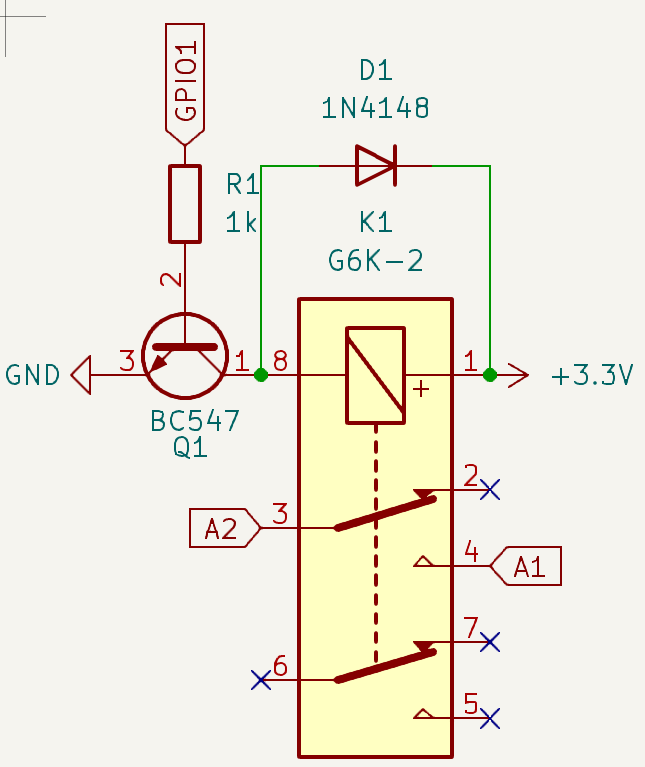

Adding in the connections for both foil and eppe along side a connection to the opponents lame it looks something like this:

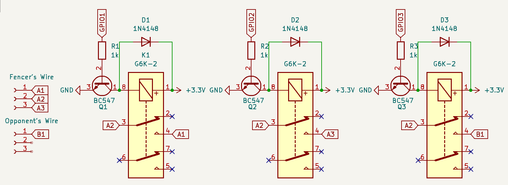

### BOM

I have begun putting the components from the schematic so far into the BOM. I have tried my best to get accurate prices but they may be a bit off due to USD exchange rate.

The main thing I am unsure of is sourcing - particularly given the request to go through the cheapest supplier. This is a request I fully agree with but am unsure of how to best implement. Aliexpress has far cheaper prices per unit for like 100pcs but since I only need three getting it for a much worse price from a supplier within australia (who is renowned for having bad unit prices) ends up being slightly cheaper (around USD0.50) to buy 3pcs relative to the 100pcs on Aliexpress.

**Total time spent: 4h**

## June 3rd: Component research, new schematics

I continued researching suppliers for some of the components I am using. I have also continued developing the schematic for the resistance measurements. Furthermore, I worked on implementing the internal weapon tester. The internal tester will allow this to be used to check wiring of a weapon. While full competition boxes can be used for this weapon testing functionality, a unit will normally set you back a couple of thousand dollars meaning that incorporating this function into a smaller, more portable, and cost efficient package will be a valuable tool for diagnosis and performing repairs away from the piste.

### Resistance Checker

Previously, I settled on using a voltage divider based system to measure the resistance of components. This was because of the small form factor, low cost, and reduced complexity - especially when administrating a pass/fail against a set value.

The feature will focus on testing the body wire as it is the most common and exposed point of failure. This means it is a simple pass/fail to check the resistance is under one ohm. To get the result, a 1 ohm resistor will be places parallel to the wire and the proportion of voltage that takes the wire path can be used to calculate the resistance. A 1 ohm resistor is chosen for reference as the closer the reference resistor is to the value we are attempting to measure, the more accurate the reading is. This means that while this is not the most accurate way of measuring a wide range of resistances it will be more than sufficient for our purpose of giving a pass/fail with some indication of what the resistance of the body wire could be.

In a voltage divider, the output voltage can be calculated using:
*V*~out~=*V*~in~*R*~2~÷(*R*~1~+*R*~2~)

Since we are measuring the output voltage, we can rearrange the equation to have *R*~2~ as the subject:
*R*~2~=*R*~1~((*V*~in~/*V*~out~)-1)^-1^

Within our system, all other variables are known (provided we use an analogue port to measure *V*~out~):

| Variable | Value |
| -------- | ----- |
| *V*~in~  | 3.3V  |
| *V*~out~ | DIO   |
| *R*~1~   | 1Ω    |
| *R*~2~   | ?Ω    |

To achieve this, the circuit will look something like this:

However, one important thing to note is that R2 will be out body wire. As such it will actually be connected through a series of ports.
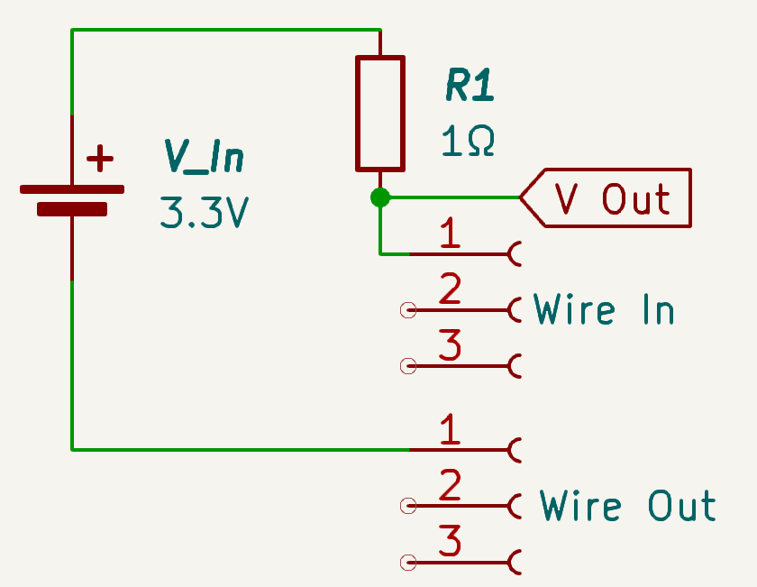

When we chain three of them to access all of the wires:
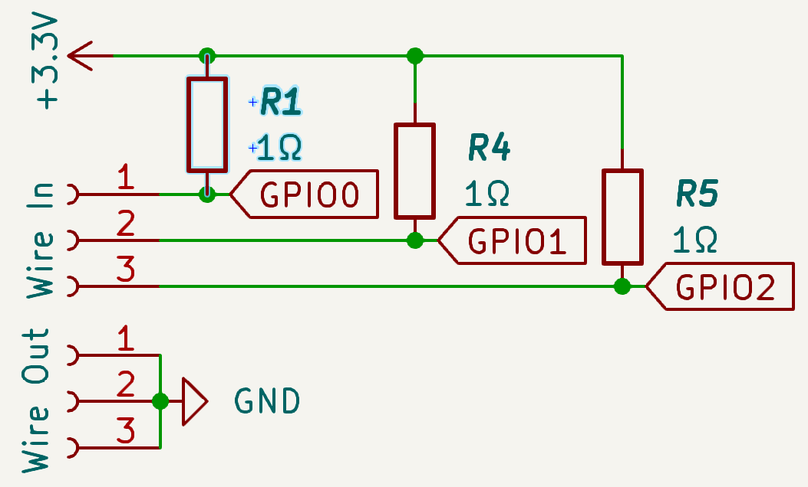

### Weapon tester

The weapon testing portion is fairly simple. While complete fencing computers need to pay strict attention to the timing of the match and the interval between hits, for testing weapons the high precision is superfluous. In order to identify that all wires are connected correctly, we will apply a voltage to pin 2 and then read which of the other wires the voltage is fed to. It is also important to include a reference to the opponents lame to allow for full foil/sabre testing. This role can be fulfilled by a metal tab on the housing.

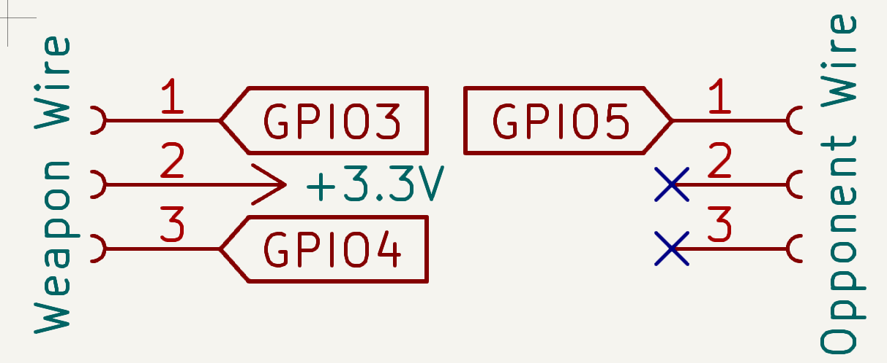

However, this creates a problem where we have nine ports just for testing the wire and weapon. In order to aid this situation, we can try to take advantage of the GPIO functionality of the esp32. For this, I will be targeting the ground side of the voltage divider module. This is because it will be isolated from the high side in all cases other than resistance testing.

Remember how earlier, it was decided to use DPDT relays as SPST ones are hard to find and more expensive? This is going to be of great benefit.

While there is probably a fancy way of implementing something like this using diodes, transistors, and differently configured GPIO pins on the ground side, we already have the relays so we may as well use them.

By linking the weapon port pins to the relays we now have the ability to switch each pin between two paths. This will allow the single set of connectors to be switched between the weapon testing circuit and the voltage divider circuit.

The resistance of the relays is negligible and so will have little impact on the resistance measurements especially at the precision we are dealing with. If any interference occurs, it will also cause the body wire to turn a false positive for high resistance which is teh preferable failure mode as a false negative would potentially further complicate troubleshooting.

After implementing these changes and unifying the schematics we are left with something like this (I know these are not the proper GPIO pins yet. I am leaving them generic until a microcontroller is decided upon):

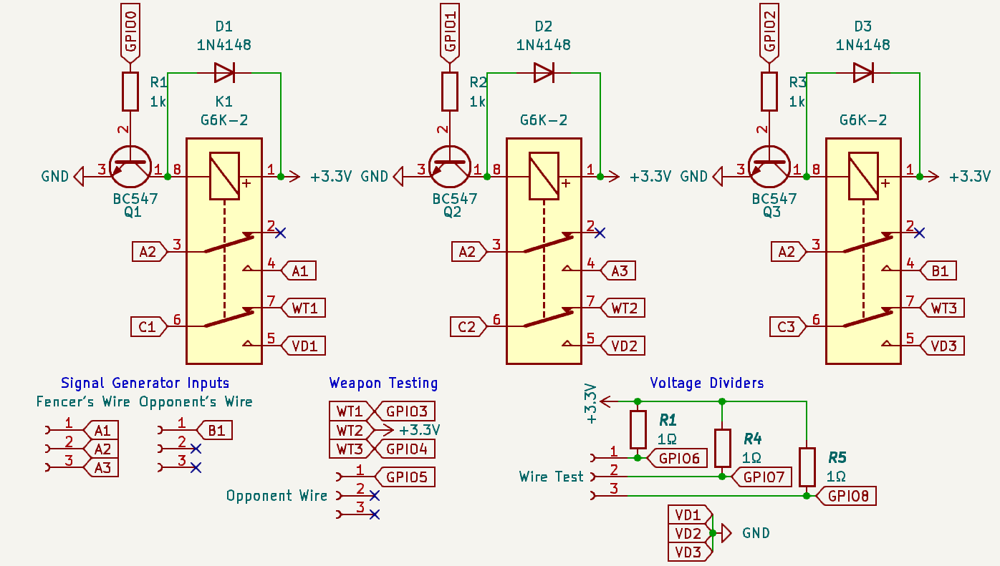

### Plans for additional relays

I would also like to consider how the two ports used on the signal generator can be reduced. Currently I plan on taking the connector only used for the opponents lame and using an additional relay to switch it between the function generator and the high side of the voltage divider. However, it may be necessary to use two relays (4 switches) in order to prevent back feed issues into the other lines when testing. This issue is unlikely to change the results of tests BUT could damage the external box being tested, and as such I will proceed with caution. While this change would increase the PCB footprint, I think saving a full connector will be worth it as adding connectors not only increases the PCB size but also its perimeter by at least 50mm on a single side.

### BOM Update

I have continued looking into suppliers for the components from last entry. I have also added the voltage divider resistors to the BOM.

**Total time spent: 2h**

## June 5th: Connector Revisions

### Additional relays

I have added the extra relays to the schematic. This allows the auxiliary port's connections to be switched between the signal generator and the high side of the voltage dividers. This eliminates another set of connectors bringing the total down to 3 sets. While I would love to bring this down to two, adding another three relays and having to add two steps in routing signals does not currently seem worth it.

### Other changes to schematic

I have also added an espS3 symbol to the schematic. This is not the final microcontroller I plan on using and is mostly there to avoid the net errors from KiCad. Over the next couple of days, I plan on selecting the final microcontroller.

**Total time spent: 1h**

## June 15th

### Selecting Microcontroller

In order to complete the rest of the schematic including IO, displays and charging/batteries I will need to select the microcontroller. I am currently looking at an esp32 based controller, but need to define the technical requirements.

Bellow are the requirement for the project based on the current schematic and plans:

|          | Requirements  |
| -------- | ------------  |
| Wireless | None          |
| COMMs    | Serial, I^2^C |
| DIO      | 12 Pins       |
| Power    | Low Power     |

I intend on using a usb port to facilitate charging. If the selected controller supports USB, the same port will be used to program it.

The main options I am considering are the ESP32-S3, ESP32-C3, and ESP32-C6. The the S3 has greater processing power and USB at the disadvantage of significantly higher (up to 2x) power draw during sleep. This may have a significant impact on battery life. The C3 has improved power draw, but lacks inbuilt ROM. The C6 has the best battery performance of all options. However, it also has limited processing power.

Reflecting upon the needs of the system, the computational workload will be minimal - mostly setting GPIO values with no background tasks or wireless functionality/data transmission. Because of this, I am choosing to proceed using the C6. Other than processing power, it has few limitations over the C3 for this use case and because we are not overly concerned by how quickly it can tell an LCD to draw a rectangle even this point is fairly minimal. The C6 also has the advantage of a slightly smaller profile.

From the C6, it is then needed to consider using it as an SOC or a module. While an SOC provides greater customization regarding the chipset's function, the range of module options have several advantages. These include lower development time, and included ROM packaging.

Because of this, I am considering using either the ESP32-C6-MINI-1U or the TinyC6 board from unexpected maker, with the benefit of the later being built in charging circuitry/PMIC. With the MINI module, the U variant would be selected due to its decreased size from elimination of the PCB antenna - a change that does not effect this project due to its lack of wireless capabilities. However, the footprint & packaging of the TinyC6 are non-ideal as it is dependant on jumper pins for mounting which would increase the full units size even more than the bulky banana jacks already are. As such, I will continue planning around using the ESP32-S6.

**Total time spent: 3h**

## July 1st

### Building out interfaces and revisiting hardware definitions

Following the work selecting a controller previously, I am revisiting the requirements of the project to ensure that everything is still in alignment. The core functionalities of:

- Resistance testing
- Weapon testing
- External signal generation

were outline previously, and have all been addressed so far.

As mentioned at the start of the project the qualities expected for the device included

> **Weapon & Fencer Interfaces**
> - Body wire connector - 3 Pin Banana Plug (FIE)
> - Eppe weapon connector - 3 Pin Banana Plug (FIE)
> - Foil/sabre weapon connector - 2 Pin Banana Plug (FIE)
> - Ground tab - strip of metal to attach lame clip
> 
> **User Interfaces**
> - Weapon Selection
> - Mode Cycle
> - Screen - For output of test information & manual test feedback
> 
> **External Box Test Interfaces**
> - 3 Pin Banana Plug (FIE) output port to test external hit machines

So far, we have been able to reduce the 4 weapon/strip connectors down two 3 connectors by using an additional set of relays to make one of the ports multi-functional. This was determined to be worth the extra space for relays as teh extra connector's size impact was restricted by the housing perimeter not the area, and as such was more problematic. However, adding even more relays to reduce down to two connectors would go past the point of returns.

Regarding the rest of the interfaces, the weapon selection will be fulfilled by a tri-pole switch with mode functionality being served by a button. This is because while weapon is a fixed set of three options, mode may change with software versions or require additional functions such as a long hold implemented in the future. From these definitions, it will require an additional three GPIO connections to connect the button & switch peripherals (1 for the button. Two for the extreme poles of the switch with the centre pole detected by absence of both other poles).

Regarding the screen interface, I am currently targeting an I2C based display. While this will not provide teh greatest display quality, it will ensure that it allows for a small form factor and minimise its cost in GPIO pins. This will still bring the total GPIO pins up to 17. This stays within the C6 mini's capability of 22 GPIO pins, while leaving room for USB communications for programming.

### Updates to the schematic

From this, I have updated the references in the testing schematic to include the ESP32-C6-MINI-1 (I will have to make a footprint for the U variant later). I have also started making the changes to include the USB communications. I have also added the switch and button for reference.

In adding the USB connection, it powers the device from 5v. This will require a regulator to step down the voltage to 3.3v to power the esp. In order to reduce complexity I am (at least for the time being) discontinuing consideration of a battery power option to allow for the relays to be put on the 5v side of the regulator, reducing its current requirements.

For the voltage regulator, I have begun working with the TPS62840 as it meets the current requirements of the device once accounting for relays and displays while providing ample room for transitioning to battery in the future (including a disable mode that could be integrated with a power sequence). After adding the inductor and smoothing caps the schematic for it looks something like this:
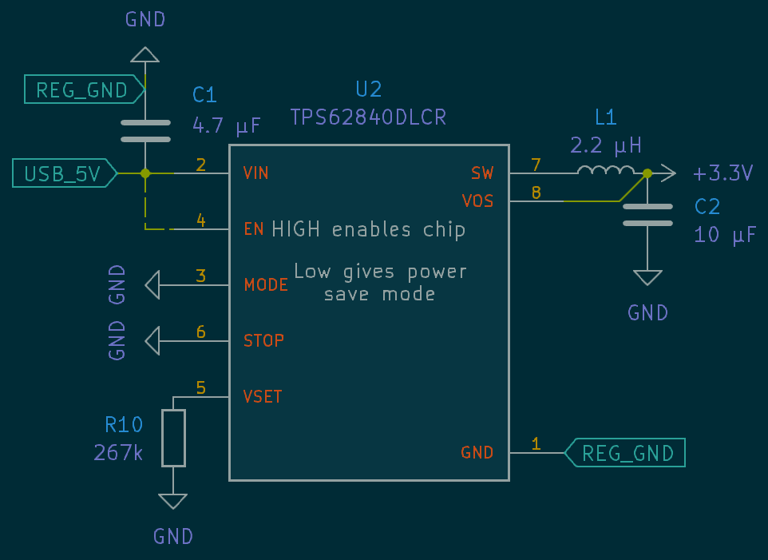

Hooking up the USB port, we obtain something like the image bellow. Importantly, the VCONN line is disconnected as it is only used by the host device to detect and eCable. The 5.1k resistor on the CC line should indicate that the device wants to draw more than the 100-500mA of the default spec and instead tell it to draw up to 3A at 5V. The data lines get connected to the ESP32 C6 and the 5V source gets fed into our converter.
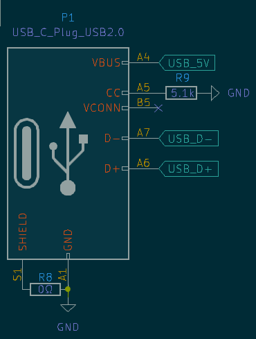

This brings the full schematic to something like this:
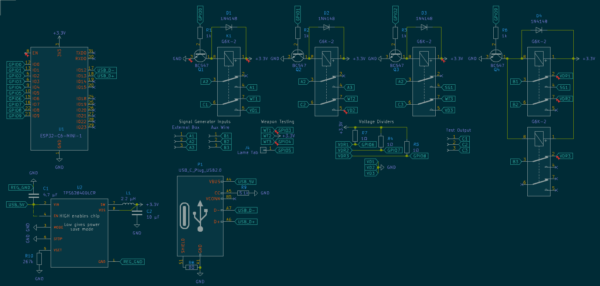

**Total time spent: 4h**

## July 2nd

### Revising hardware

Yesterday, I implemented the usb port and voltage regulators. However, the usb port's shield was fully tied to ground. This is improper practice and could lead to issues if there is a difference is static or ground references when cables are connected. It also means it fails to provide proper shielding. As such, I have replaced the tie with a resistor and capacitor coupled to prevent any issues.
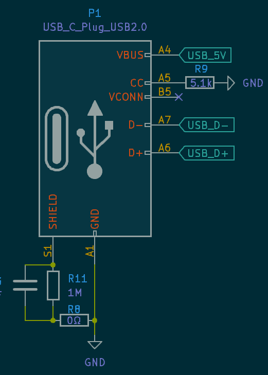

### Relay setup

After adding in the voltage regulation and usb 5v rail yesterday, it is time to reconsider the diver circuitry for the relays. As we now have a large 5v allowance and smaller 3.3v circuit, we should move the relays to the larger budget 5v rail. As the relays already have a transistor driver setup, we can just change the voltage source and swap the relays for the 5v variant without having to add any new components.

Swapping out the circuitry, each module will resemble something like this:
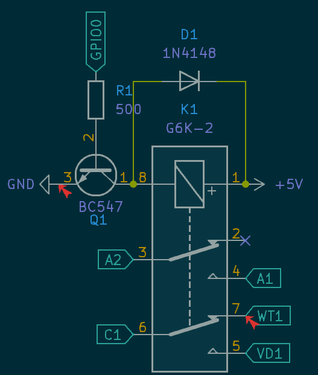

### Buttons & switches

Additionally, it is important to finally add a power switch to the board. This will enable the esp to be turned off, as well as pull the enable pin high. If the enable pin is not pulled high, the board will never turn on.
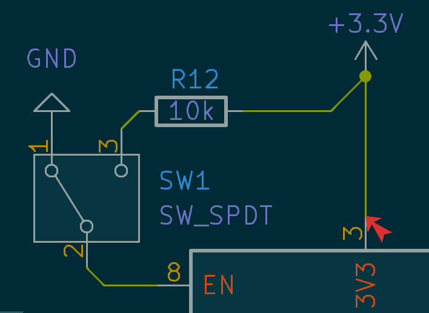

I previously addressed the fact we would need to have a weapon select switch and function button. Let's address the weapon switch. It will need to be a triple switch, taking two output GPIOs for full signal. In order to maintain proper signal integrity, there will also need to be pulldown resistors on the inputs.

This will produce a input matrix such as:

| Weapon | A | B |
| ------ |---|---|
| 1. Eppe | ✅ | ❌ |
| 2. Foil | ❌ | ❌ |
| 3. Sabre | ❌ | ✅ |

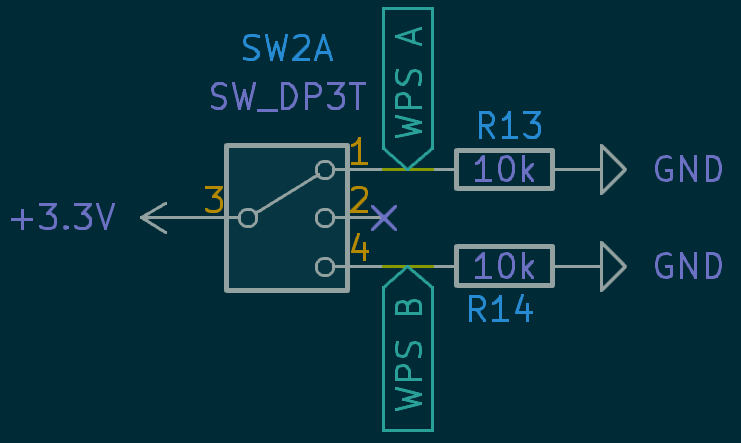

Finally, the use/mode button looks something like this, requiring a pull down to ensure clear readings.
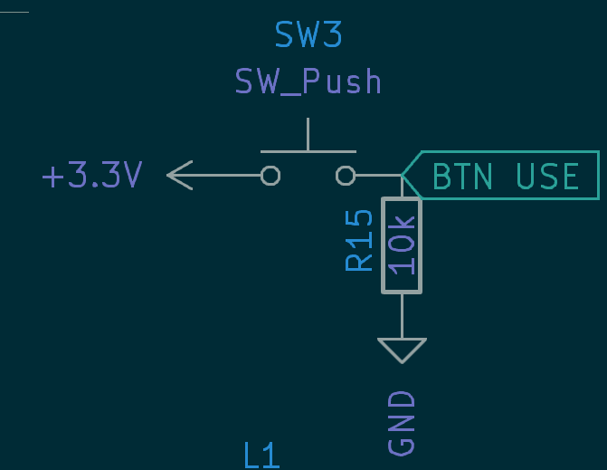

After rearranging the GPIO pins to allow for I2C to be accessed, the full schematic looks like this:
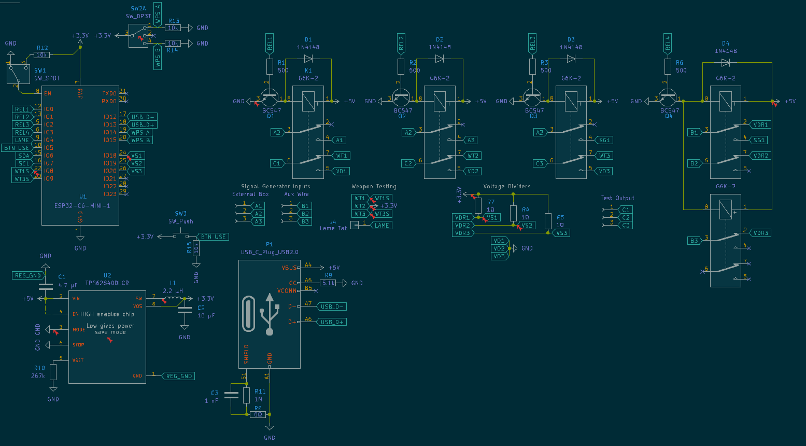

### Component Selection

I have begun working through the schematic planning the physical outline of the board. This has included finding suppliers and settling on footprints for the capacitors, inductors, etc. Some of these have been updated in the BOM, but no visible changes have been make to the schematic (footprints will become evident when doing board layout).

I have also revisited the footprint of the resistors, and found a supplier for almost all the values I need. There is just the 267k resistor remaining, which I don't want to round on as it is for setting the output voltage of the regulator.

After this, the PCB is starting to take shape. All that remains is fixing the layout of the ESP to remove the antenna keepouts (I am using the non wireless variant), add footprint for the voltage regulator, and fix up the body wire plugs. After that the only thing left to do is the screen.

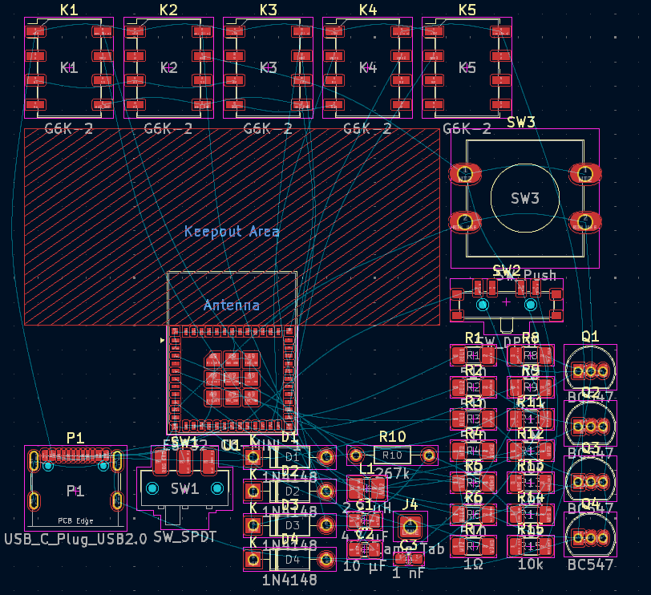

**Total time spent: 3h**

## July 6th

### Revisiting power management IC

Currently, the final barriers to completing the board files are sourcing the voltage management IC and the screen (the screen will impact the form factor of the device). With the currently selected IC, I need to find a supplier and check availability. As it is name brand TI, there are no clones on Aliexpress. Looking through other providers, the only way to get a hnd solderable variant would be to go direct through TI or Mouser. As I already need PCBA due to the ESP32 C6, I also investigated JLC's cost for the component.

In my research, I also came across the TPS62849 which provides a fixed output without needing the extra resistor. This was also advantageous but was not available from individual suppliers as a hand solderable variant. Looking at ordering from JLC as part of the package, it is no cheaper than ordering direct from a name brand supplier :(. This is because of the upcharge for Extended list parts and extra cost associated with their reel swap charges. This gives A$2.50 for the ...49 and A$1.40 for the 40.

I have also found that the hand solderable variant just is literally not produced for the 3.3 version of the chip, only for the 1.55v version. As such, I will be progressing using the PCBA variant from JLC as it was about as good a price I could find elsewhere. The updated schematic looks something like this:

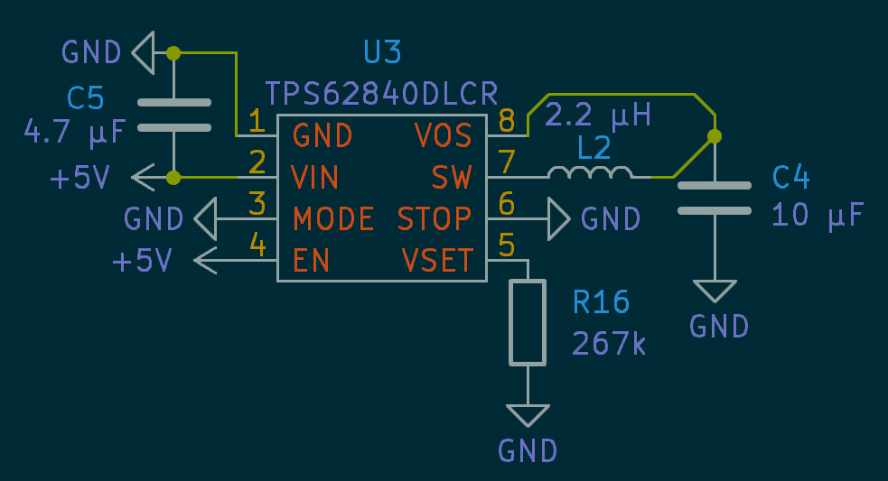

Handily, there is also a recommended board layout to use when doing the board layout. I have included it here so I don't forget.
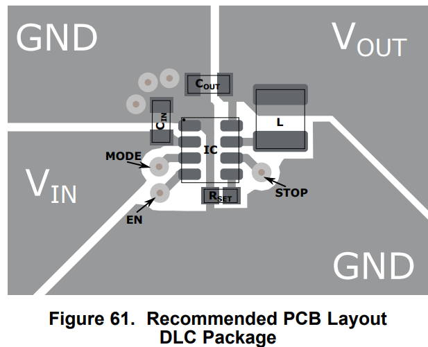

**Total time spent: 1.5h**

## July 7th

### Revisiting power management IC (Again)

Reflecting on presious logs, I think I've placed too much importance on overdesigning the load capacity of the 3.3v rail. After doing proper analysis of the components in using, the full power draw should not come to more than 800mA, meaning I am fine to use a sub 1A supply. This dramatically reduced the ease of implementation.

Because of this I have changed to the AMS1117-3.3. This has advantages of

- Fixed 3.3 output
- Available component
- Hand solderable
- No extended PCBA
- No inductors

The updated implementation is sooooo much nicer and is no longer stupidly overkill or complicated.
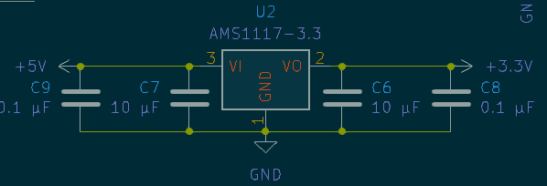

### Looking at microcontroller

Looking at the ESP32 C6, the MINI module has a key issue regarding its construction. All of the contacts are on the back of the board. This means that with my current setup, I have no way of soldering it onto the board other than using PCBA. As I would like to avoid the hassle and cost of PCBA, I am investigating moving to the non mini variant as it has the option to hand solder it to your board.

Changing to the non mini ESP32-C6-WROOM-1U-N8 significantly reduces costs from the PCBA charges as well as simplifies the assembly process.
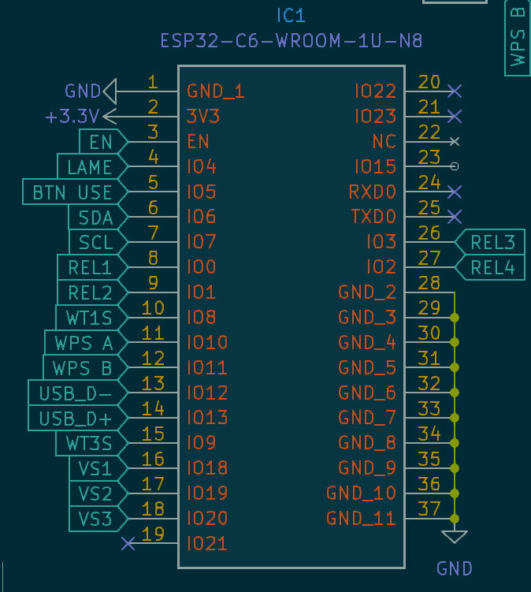

I have also added a header to connect the display to:
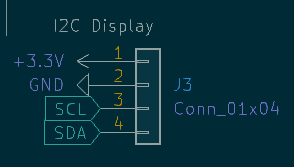

From this and my research onto the physical shape of the display, I have begun to flesh out a possible layout for the board:
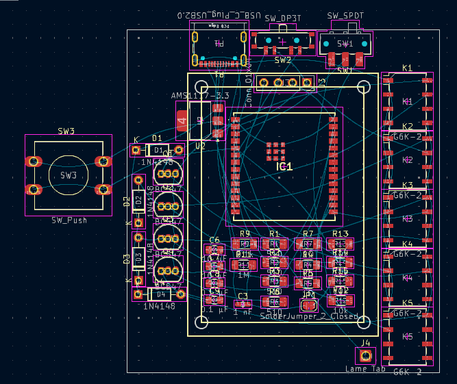
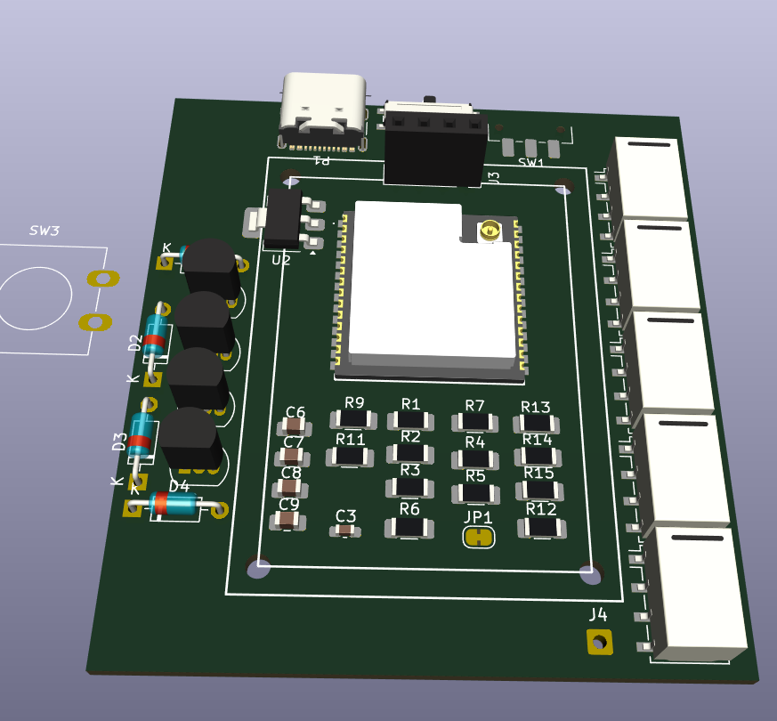

**Total time spent: 2.5h**

## July 9th

### Connectors

Connectors for the system include a USB port for power & communications, three sets of wire connections and the lame tab. All three wire connectors will use the standardised FIE plug spacing illustrated earlier, however this does not account for the weapon side of a foil body wire. To account for the foil body wire, one of the inputs will need to be duplicated with a foil connection that is electrically continuous with the three pin one.

The USB connector will be USB-C to take advantage of the greater power delivery it offers.

The banana plug connectors will be 4mm with the smaller of the foil/sabre pair being 3mm. This varies due to tolerances in equipment manufacturing but works as a guideline. The 4mm plugs are highly standard within a variety of applications and so are easily available on Aliexpress. However, the 3mm plugs are not. As such, I anticipate that I may have to use a 3.5mm audio jack with all the pins bridged to approximate this purpose. The other option is to use an RCA plug as their inner pin has an OD of around 3.2mm. RCA plugs are really easy to find as TH solderable components. However, their use of an external pin makes it hard to adapt and align to this use case as both plugs need to be aligned.

I am currently looking at two main options for the 4mm plug. One is possible to solder to and leave a wire to the PCB. The other cannot be soldered to and needs a 6mm blade crimp to use. I am leaning towards using the crimp based solution as the solder option has a zinc coating on it. While many pieces of fencing gear use zinc coatings they are an absolute pain to solder to. Difficulty soldering would likely let the piece heat up fully and melt the connector. So I will stick with the crimp to save the pain and possible failure. It is even possible to gain almost enough measurements of the product form the Aliexpress page to translate it into CAD.

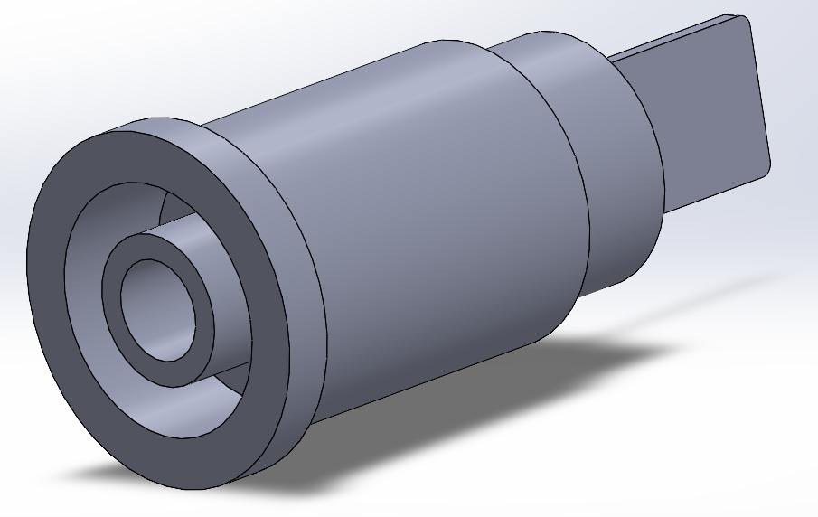

However, this has the key issue of using a really shallow connector. This is likely to cause issues when inputting the prongs of the wire. In contrast, an alternate connector I have found has a much bigger connector hole. It also has the advantage of being through hole which improves mounting and removes the need for crimps. I have approximated it to something like this:

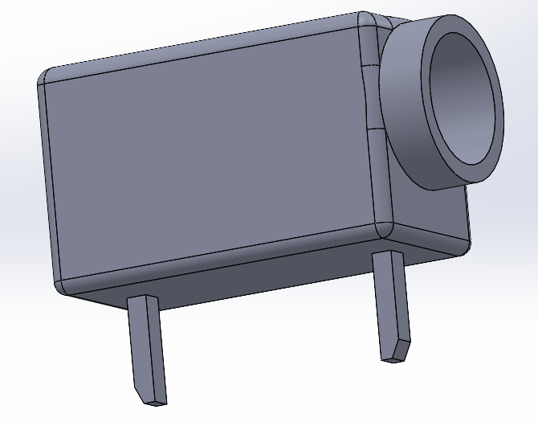

I have also created a KiCad footprint for both the individual plug and the whole three pin fencing connecotr.

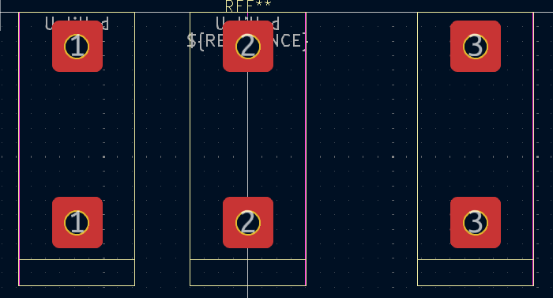

Now that I have a footprint for the weapon connectors, I can add them all into the draft of the PCB. This starts to express why I was so eager to reduce the number of connectors as much as possible. My current plan is to have them one each side and leave one side for the USB-C port and weapon select switch.

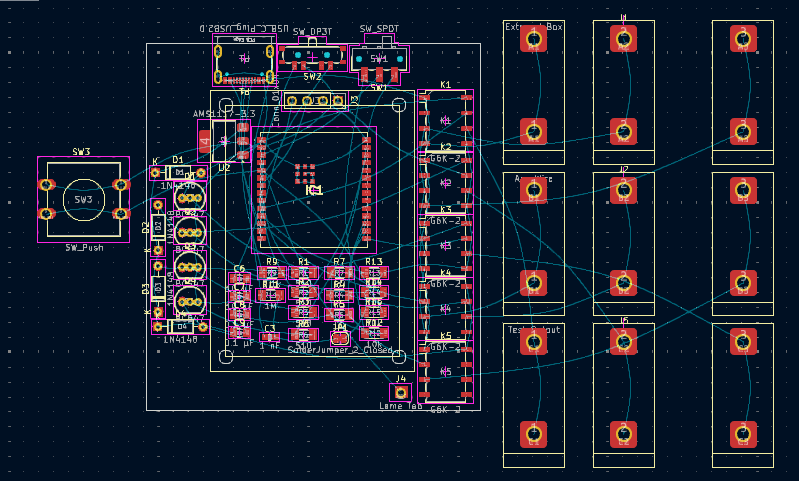

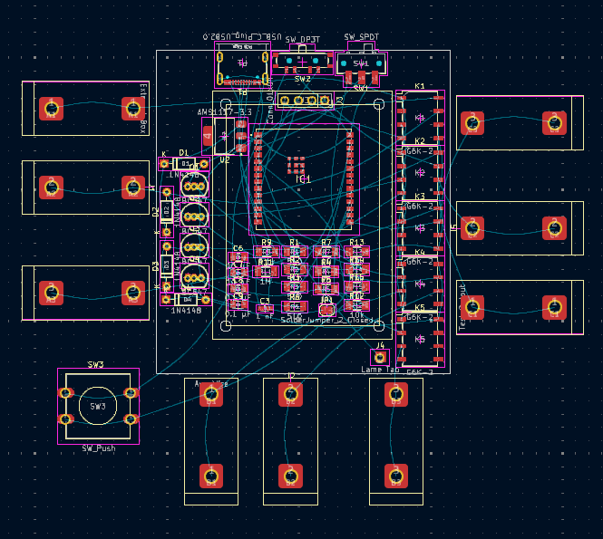

Taking advantage of the space between the pins of the connector, I began the rearrange the components. This has compacted the footprint a lot, but will require a careful order when assembling. I have also added in some placeholder  mounting holes.

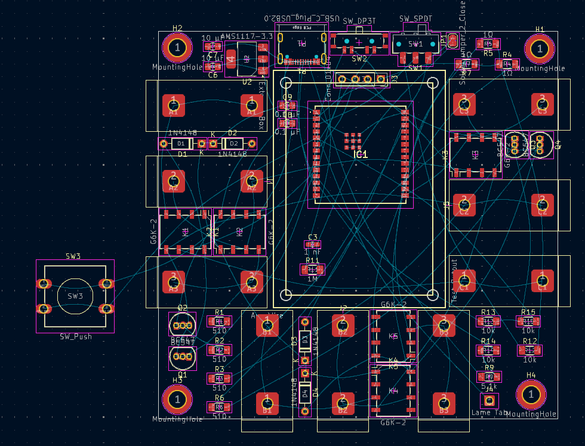

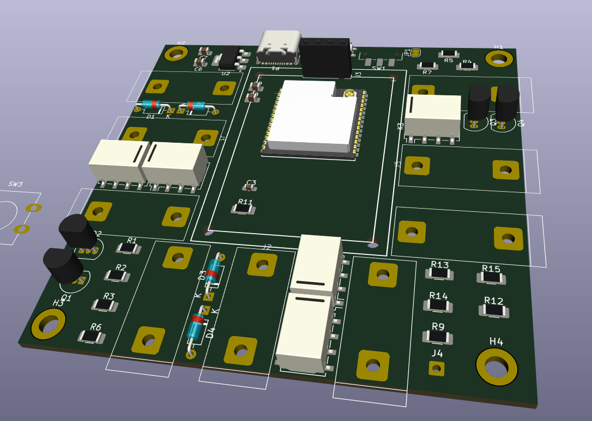

Working on the footprints and layout a bit further we can get to something like this:

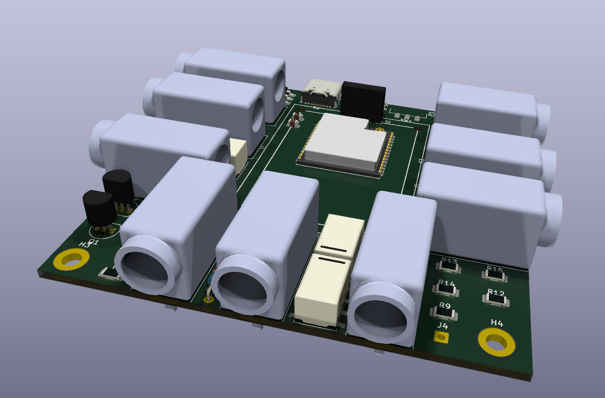

**Total time spent: 4h**

## July 14th

### Packaging

Working off of the PCB from last session, this is getting close to production. All that is left is to route traces, and design a housing to be 3D printed.

Currently, the main issue is adapting the unit to allow for the weapon end of a foil body wire to be connected. This poses an issue for a few reasons. First, there is limited space on the PCB to add the extra connector. Second, the 3mm plug of the foil connector poses many issues. It is almost impossible to obtain from suppliers, with the closest available off of aliexpress being 2.5 & 3.5mm audio jacks.

Because of this, I have two main options: use panel mount connectors on a section of the housing that is raised above the rest vertically. OR create a plug adapter to convert to the foil connector when needed. The second option is preferable from a housing perspective. The main issue with the second option is that it has risk of increasing the resistance of the path leading to false threshold detection for resistance measurement. However, this should be possible to account for in code since the resistance of the adapter would be fixed.

By rearranging the layout of the resistors to the gap in the centre, it is possible to move the connector to the side leaving space to add the second pin of the body wire connector, reusing the 4mm connector for pin 3. I have found a panel mount connector for the 3mm which should hopefully work. Not being PCB mount allows for better alignment with the existing height of the other connectors.

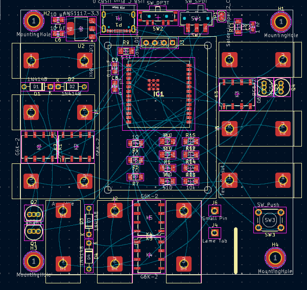

Connecting most of the data connections I got something like this:

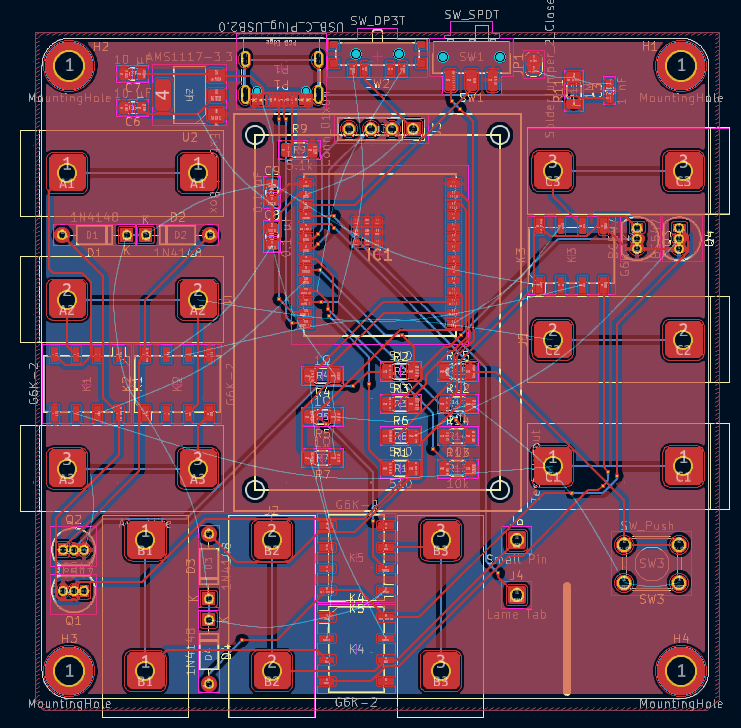

**Total time spent: 2.5h**

## July 16th

### Working on PCB

I continued routing all the data lines and began working on power. The routing is a ratsnest and I am ashamed to publish it. This is primarily due to only having two layers. I started with two because i through it would be possible, and wanted to stay under the $2 price cap for JLC.

Working from this, I have completed all of teh routing and removed all of the silkscreen collisions.

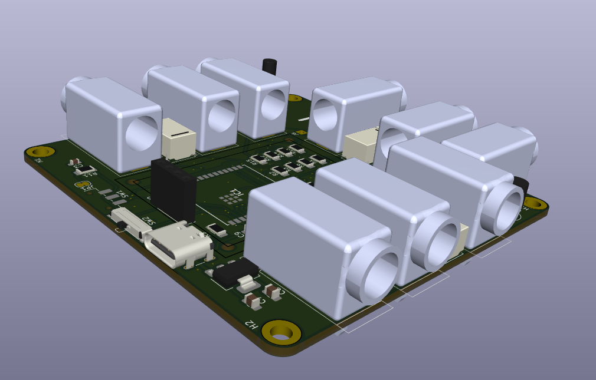

**Total time spent: 2h**

## July 17th

### Finishing PCB

I fixed up the display mounting holes, and resolved the last two ground plane connection issues to satisfy the DRC. I then checked the PCB on JLC to confirm the details for the order, and get it ready to submit.

I then started contemplating the USB-C port, which was teh one element I was concerned about hand soldering due to the small tabs and close spacing. I was fortunate enough to find a through hole variant with stock that I could use instead. This will work much better and eliminate the concern around possibly needing PCBA for a single connector. (I have no prior experience soldering SMD and did not want to gamble)

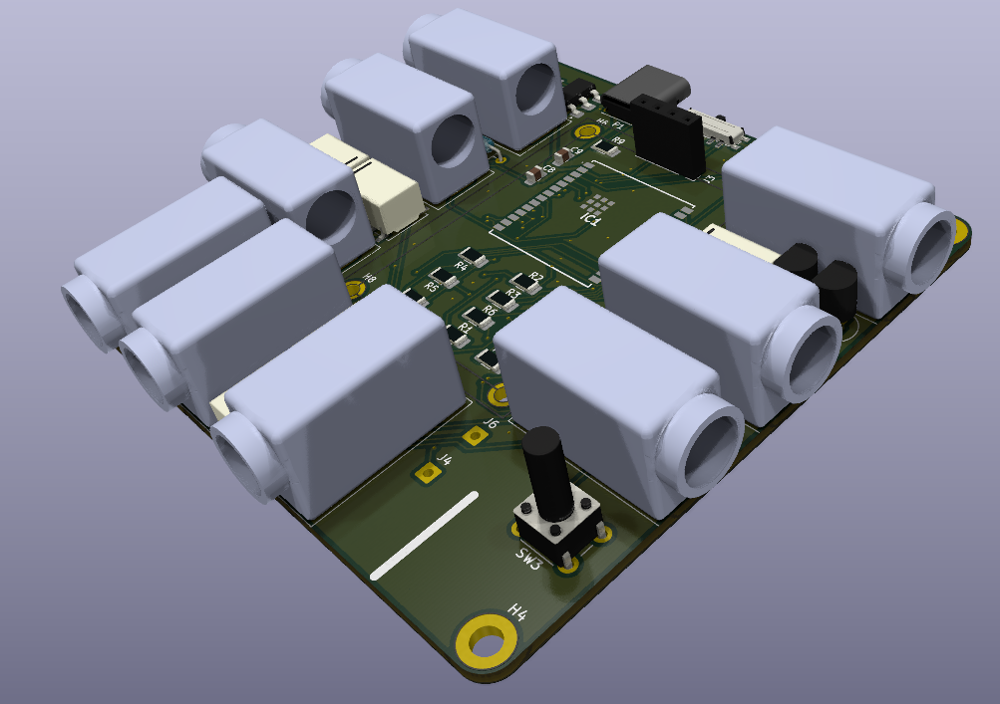

### Housing

Having completed the PCB, I exported the design files and started working on a housing for the device. Thankfully, I already have models for all the PCB components. This meant the only thing I will have to create from scratch is the display CAD. However, the Aliexpress listing has most of the dimensions for once.

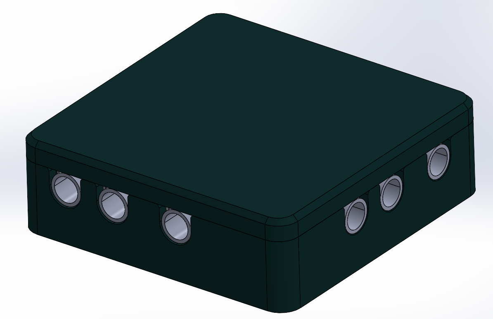

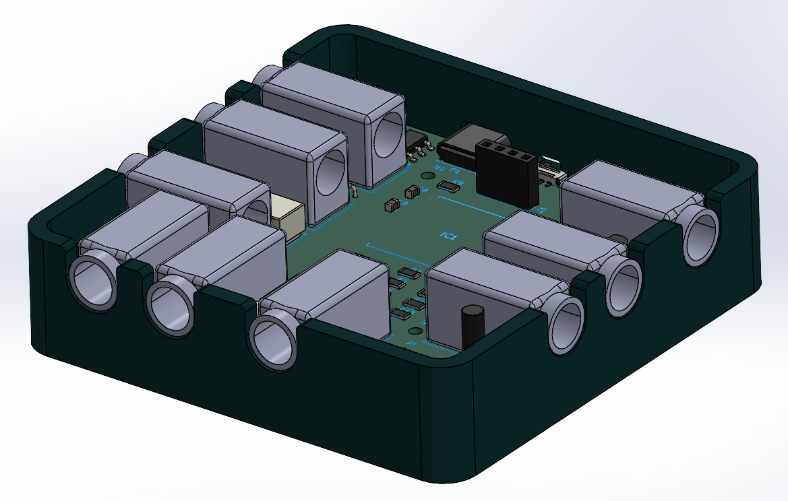

**Total time spent: 1.5h**

## July 18th

### Working on CAD

I completed the CAD for the display, and put it into the assembly. This lead me to realise the mounting holes on the PCB were misaligned.

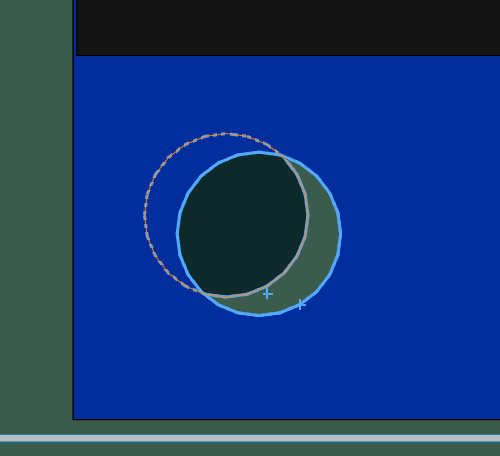

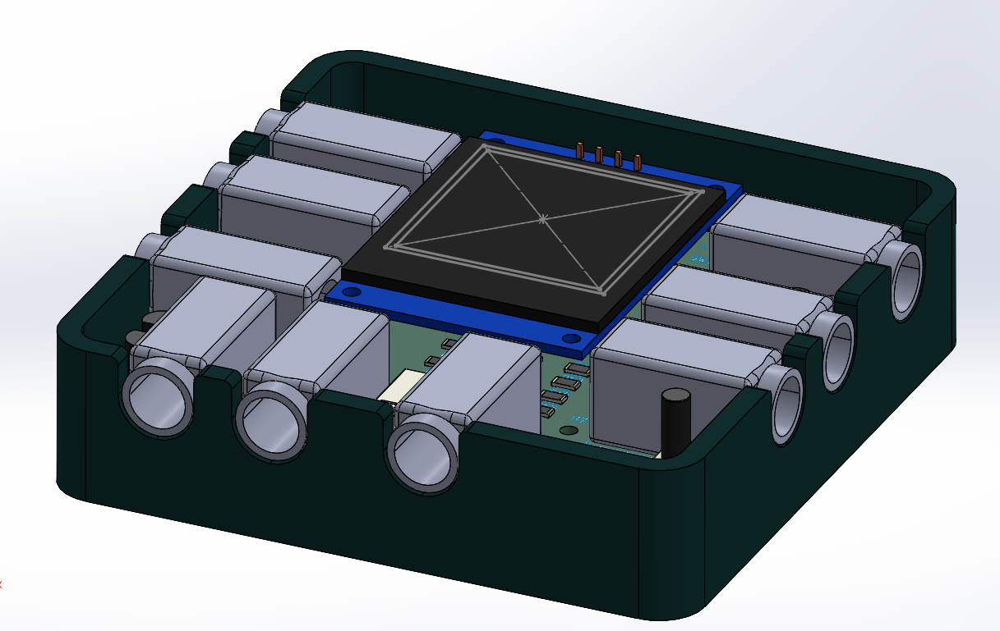

As such, I updated the PCB based on how offset the CAD was. I then modified the top cover to expose the display. This raised the issue that I failed to make the display centered. This was rectified.

I then added cutouts for all of the buttons, switches and the USB-C connector. The tolerances on these will be adjusted and finalised once I have the assembled PCB. The function button looks short in this version of the CAD. That is because I will be ordering a longer button but KiCAD only had up to the length you see in the CAD. All this leaves is to add the 3mm connection.

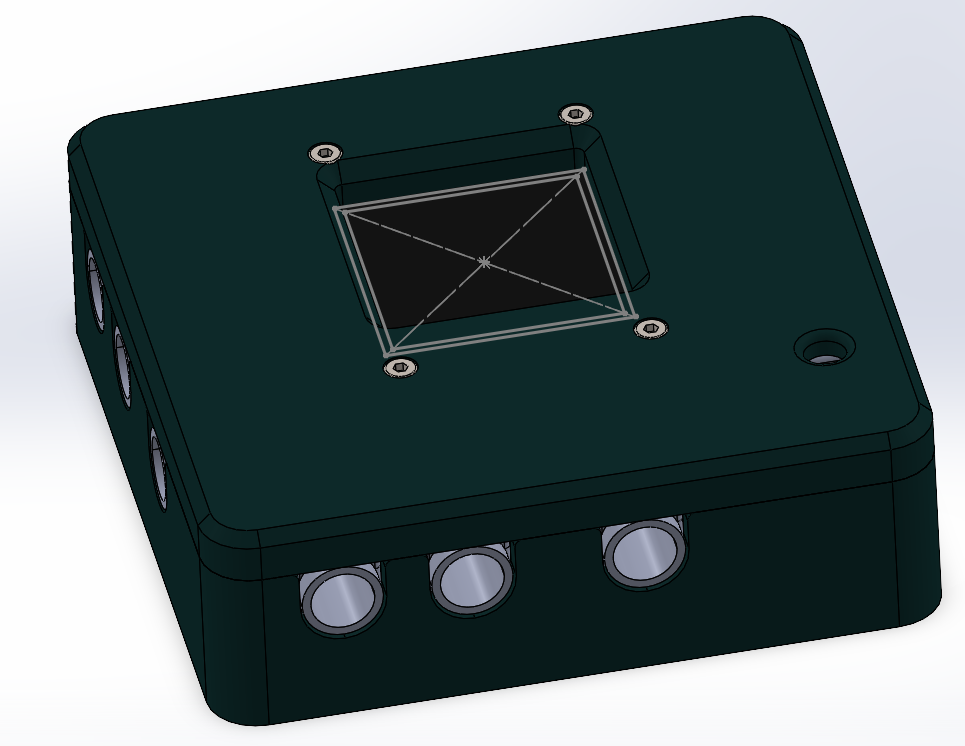

Creating the 3mm connector:

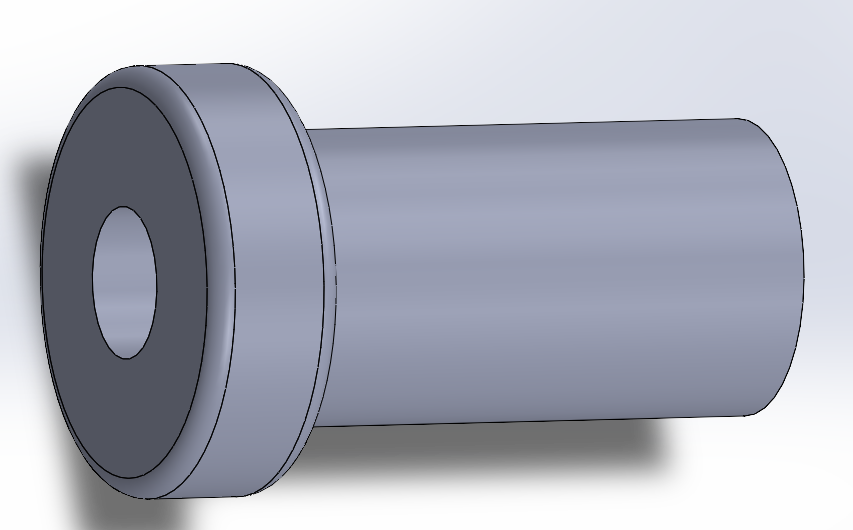

Then assembling it into a slot on the housing:

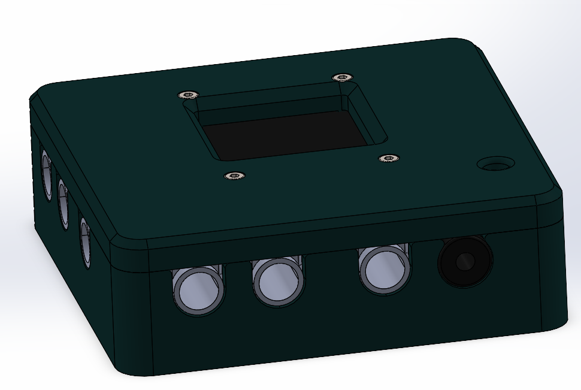

### Code

I began working on the code to run the unit. Today I defined all of the IO, started implementing the display, implemented weapon selection, and started on some other functions.

**Total time spent: 3h**

## July 19th

### Working on software

I continued working on the programming for the ESP. I focused on putting together the logic for the resistance checking. This was simple, just needing to calculate it from a voltage divider after adjusting the analogue scale into a voltage from the 3.3v reference of the chip.

I added a helper functions to calculate the voltage and check the resultant value to reduce code footprint and spaghetti. These then fed into a function that calls everything to check. I am waiting to fully define all the graphics until I have the rest of the code fleshed out. I also will tweak the graphics a bit after I can visually check them.

I completed functions to set all the relays and GPIOs for each testing mode.

After finishing the foundation for the resistance checking, I worked on the code for manual weapon readout. This included another helper to set the relays. I also added a logic set to check the weapon and then read each weapon input pin and the lame to see off-target, hit, and no-code. This is then written out to a variable for storing weapon state.

The relays have been set to initialise for the generator, but will change when used. I also added helpers to set the relays for different signal states.

I am now realising that a couple of these inputs probably should have had pull downs on them...

Doing the generator, I also noticed that I am accidentally pulling the B plugs to 3.3v through the voltage divider. As such, I am going to need to think about how to rectify this.

**Total time spent: 1.5h**

## July 20th

### BOM Revisions

I revised the BOM to be up to date with the current parts. ia slo removed old links and replaced them with new ones.

#### Schematic

Yesterday, I identified some issues with the schematic. These included needing some pull down resistors on inputs, however the main issue was with the relays.

INvestigating the best course of action with the relays, the foremost solution I am considering is adding another relay to buffer the connection to the B connectors:

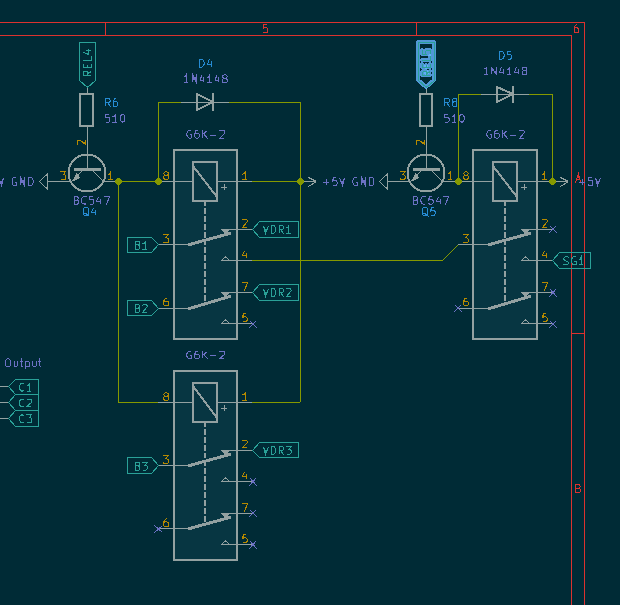

While I don't want to add another relay, it seems to be the best way of preventing possible damage to the ESP. It is not possible to easily guard against random voltages being sent into the esp other than by adding a relay as the polarity and voltage of the source are unknown and would change between fencing boxes so a diode or basic transistor wouldn't work reliably.

I added the extra relay to the PCB, and began rerouting the signals to match the changes. I also changed the footprint of the diodes to be surface mount and increased teh size of capacitors to 0805. Adding the extra resistors I changed the board layout to move the resistors closer to where they needed to be. This cleared up the wiring a lot as I no longer needed races running across the board only to have a resistor going to the ground plane.

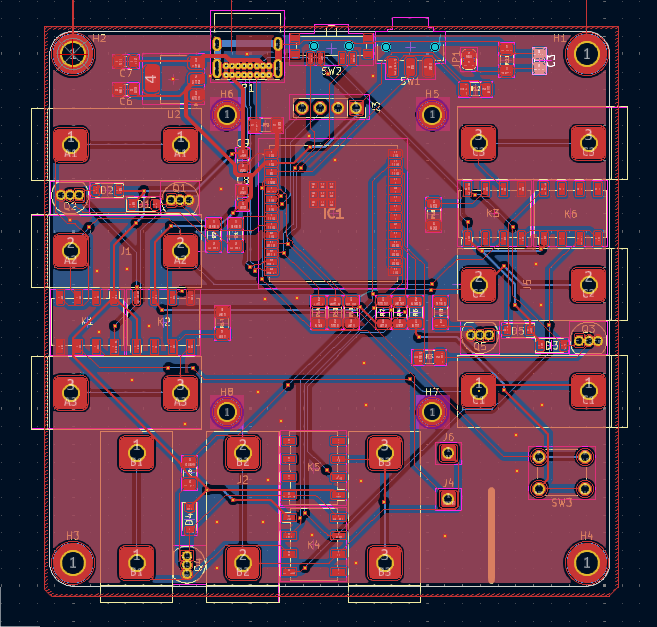

**Total time spent: 3h**

## July 21st

### PCB

I finished up the last couple of issues from yesterday making sure all of the ground plane was connected. I also fixed some minor silkscreen clipping and under minimum silkscreen heights.

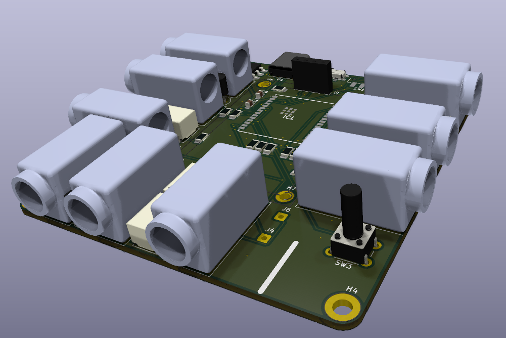

None of the changes have moved the physical positions of any connectors or switches so there do not need to be changes to the CAD because of this.

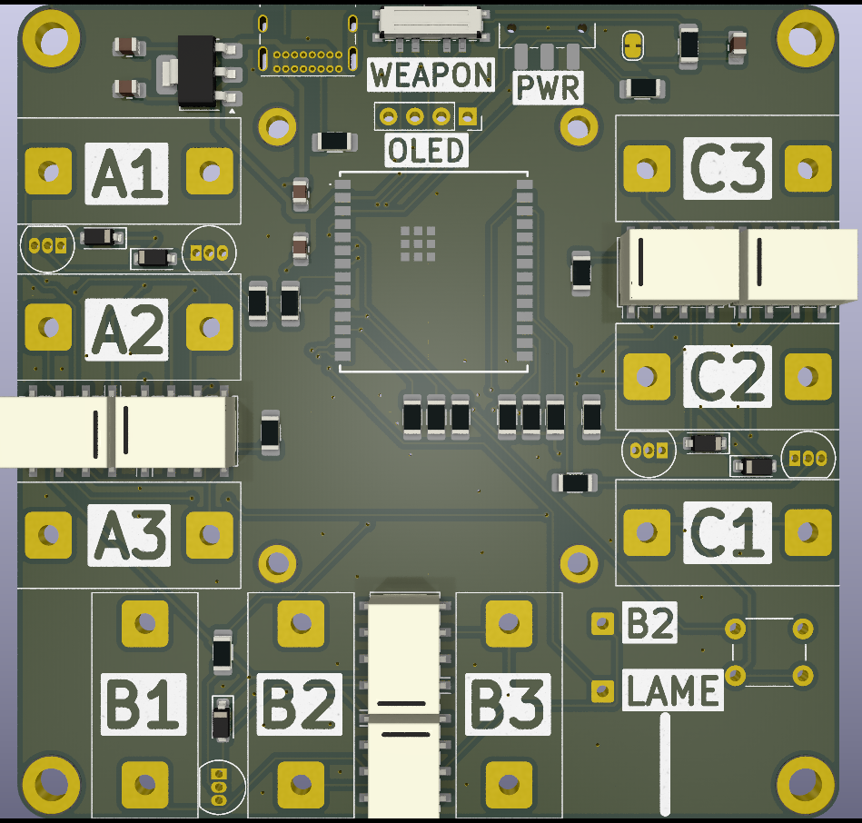

### Working on Code

Now that I know how the extra relay is implemented, I can factor it into the program. We will set R5 to be open all of the time unless it is being used for signals. R4 can then be set high when signal generation is being used and normal when resistance mode is active.

(Example of test signal)
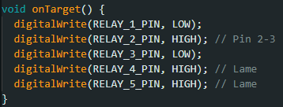

Now that the functions to send all the signals are complete, with the extra relay integrated, I can start working on the mode to manage device states and input.

By attaching an interrupt to the USE button being pressed, we can handle input next time the program loops without the risk of it being missed. By attaching interrupts to the weapon select switches we can achieve the same thing with the weapon detection. For weapon changes, we will update the stored weapon type while user input will be a flag that gets cleared when processed. While the weapon update does not need two functions now, it will be useful when dealing with updates to the UI.

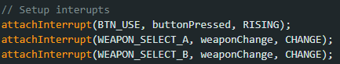
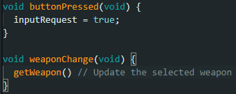

I have also swapped the control variables to enums so there are no more magic numbers!

Working on the main loop, it will check what mode it is in and then run the appropriate functions. If a function needs to it will then check for weapon.

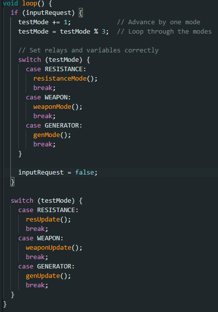

The resistance tester just needs to test the resistance each loop. Likewise with the weapon tester.

The signal generator needs to loop through the possible signals and display each one. By incrementing and modding we can keep in in a loop.

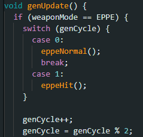

Now that the functional code is done, I can begin work on the graphics. I am aiming to get all of the graphics approximated but may have to make changes after production as I have no way of testing until then. The resistance code will show an icon to indicate a pass/fail for each wire.

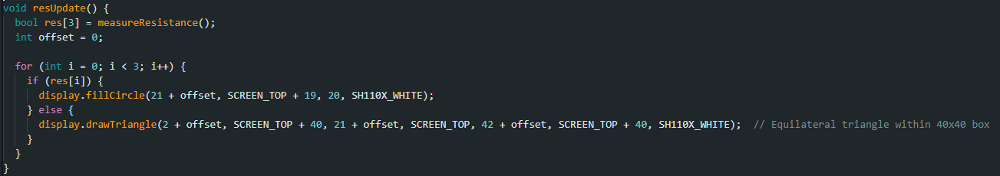

The weapon test page will show a box indicating the lamp. None for no light, outline for off target, and filled for hit.

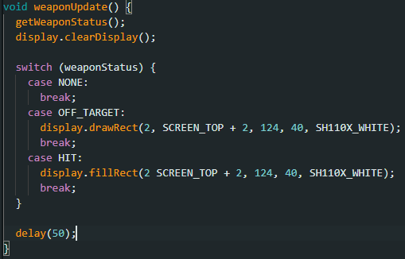

Adding display to the generator is just a matter of moving the lamp logic to s seperate function and calling it as needed.

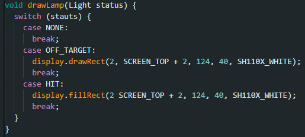
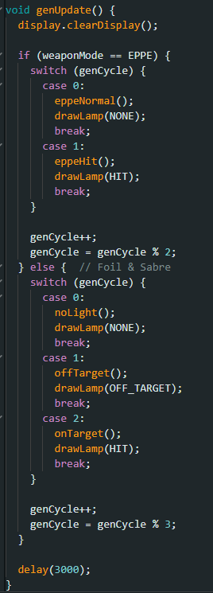

I have added the delays for the main loop inside the test functions. This is because each one needs to run at a different frequency (e.g. the signal generator should run every few seconds while the weapon tester should go continuously). Additionally, I have fixed all of the errors from the code (including the ones in the screenshots).

Finally, I have added a status bar at the top of the screen to show the current mode and weapon. This is drawn by a drawHeader function, and also runs when the new "clearScreen" function is run. clearScreen resets the display screen and draws the header. I have increased the SCREEN_TOP variable to account for the header. As I had already used the variable when writing the other screens everything will update for the content above it.

I think this is all of the changes to the code I needed to make. Tasks remaining until submission are

- Add lame tab to housing
- Fix up BOM csv
- Readme
- Readme BOM table
- Tally of total time spent

I'll go ahead and fill out the last of those today, putting it at the top of this file as requested. I'm currently sitting at a nice 45. Both a multiple of 5 & 9.

**Total time spent: 4h**

## July 22nd

### Working on CAD & Housing

I changed the hosuing to have a bold all the way through to properly retain the lid.

Keeping in mind that I also need to add a tab for the lame, I also added a cutout to mount it within.

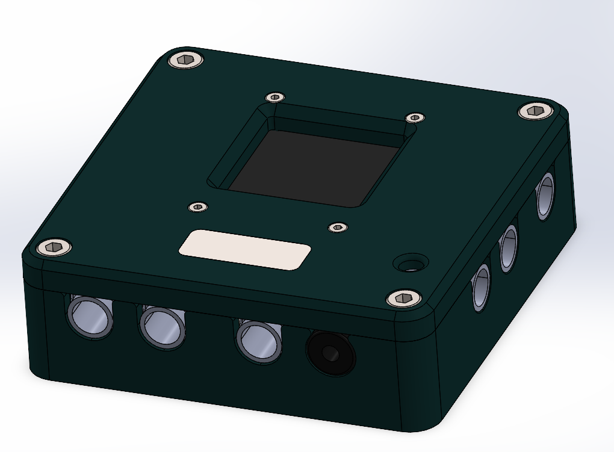

### Documentation & BOM

Having now completed all of the design aspects of the project, I can return to the list of final things I need to do.

- ~~Add lame tab to housing~~
- Fix up BOM csv
- Readme
- Readme BOM table
- ~~Tally of total time spent~~

As such, I will finish off the BOM, including prices and the last couple of links. Please note that all prices in the BOM are AUD.

I have come into some issues sourcing the ESP32-C6-WROOM-1U. Primarily that LCSC only have the non U variant which uses a larger footprint and is incompatible with the board. I should have checked this earlier, but it means I'm stuck ordering from Mouser or Digikey. Neither of which are options I like.

- ~~Fix up BOM csv~~

I have also completed the BOM for the readme. Now all that is left is filling out the details in the readme about the project.

- ~~Readme~~
- ~~Readme BOM table~~

Now that all of the requirements are met, I am ready to put the project in for submission.

**Total time spent: 3h**

## July 25th

### General Things

The project was approved, so I have been putting the orders in. In doing so, I found a supplier on AliExpress with choice shipping on bolts - I somehow missed them before. I plan on swapping to them to save some money on parts. All of the orders should arrive JUST before the deadline 🤞.

My main issue has been one of the components being flagged by AliExpress whenever I attempt to pay for it. 

I am ready to put on all the prints but the paranoid bit of me wants to wait to check component tolerances after they arrive.

I have restructured some of the files to they make a bit more sense naming wise. (All my PCB schematics were in a file named 'testing' I thought would just be for mockups, etc)

**Total time spent: 1h**
