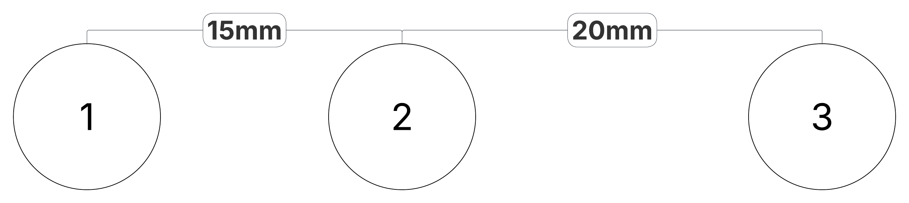

## May 31st: Initial Research & Component Selection

I began by re-reading the FIE (International Fencing Federation) documentation on the material requirements of each weapon and confirm details such as signaling information and the permitted resistances of each component. Because fencing has three main weapons, there are three different signaling protocols the device must be able to test. However, much of the physical connectors and pinouts is shared between weapons and as such I am hopeful that it will be possible to limit the need for separate testing hardware through use of a microcontroller to switch inputs, etc.

The function of testing equipment will be primarily served through measurement of resistance across components leading to a pass/fail result based on comparison to the standards. However, I also intend to add an option to select a weapon and then have weapon testing including hit detection and on/off target detection. This will require additional ports and can be self contained within the unit. Finally, I am also investigating the ability to send test signals to other score machines. Because voltages are not standardised between units, this would require implementation of a set of relays to close the connections from the external unit.

### Control Requirements

The unit will require a microcontroller to register the test inputs and generate sample outputs. This will likely be an esp32 derived controller selected further on once requirements are better established.

As there is intent to extend functionality to generating test signals for external equipment a series of relays will be required. This is because fencing computers do not all operate at a standard logic level for piste signals, with significant variation between devices. However, most devices use a voltage of around 0.75V to 1V so relays and other switching components can be designed around this low range - potentially using 3.3V rated components to provide a safe margin of error.

### Hardware interface

The hardware interfaces of the device are influenced by the definitions within the FIE technical documentation. This provides a unified system for connectors and pinouts across equipment globally.

Choices regarding the interfaces are centered around trying to provide as much functionality as possible, but will change over time as the project implementation evolves.

Interfaces that are likely required for the device include:

Weapon & Fencer Interfaces

- Body wire connector - 3 Pin Banana Plug (FIE)
- Eppe weapon connector - 3 Pin Banana Plug (FIE)
- Foil/sabre weapon connector - 2 Pin Banana Plug (FIE)
- Ground tab - strip of metal to attach lame clip

User Interfaces

- Weapon Selection
- Mode Cycle
- Screen - For output of test information & manual test feedback

External Box Test Interfaces

- 3 Pin Banana Plug (FIE) output port to test external hit machines

**Total time spent: 3h**

## June 1st: Research into individual weapon checks

I continued researching how to best implement the tests on individual weapons. The key requirements of this testing mode must include:

### Validation of resistance

While fairly simple, all equipment has specific resistance ratings that it must remain under to perform properly. If there is any increase in resistance due to rust or microscopic fractures, it can lead to the incorrect detection of a hit. This often manifests through weapons registering as off target in foil or false hits in eppe. By checking these factors, it is possible to diagnose a broken/worn out tip or a poor body wire connection (often stemming from collapsed plugs).

Required maximum resistances are:

- The bodywire must have a resistance of 1 ohm
- The spool must have a resistance of 3 ohms
- Weapon resistance of 2 ohms
- Cable resistance of 2.5 ohms

### Hit registration

In order to test that weapons are wired correctly, it must be possible to check continuity between the wires going to the button. This allows verification that hits will register. For foil and sabre, it is also necessary to check continuity to the jacket of the opponent. This is because foil and sabre only register 'valid' hits on a specific section of the body and all other hits must be registered as a separate off-target signal.

Within documentation, each pin of the standard connector is only referred to by its distance from the centre. I will define pinout numbers for them to simplify the creation of documentation and schematics throughout this project.

#### Pin Usage

| Weapon | Pin 1 | Pin 2 | Pin 3 |
| ------ | ----- | ----- | ----- |
| Foil   | Lame | Tip | Weapon/Piste |
| Eppe   | Direct Wire | Other Wire | Weapon/Piste |
| Sabre  | Lame | Tip | Weapon/Piste |

#### Hit detection

The criteria for registering a hit differ between weapons.

In foil and sabre, pins 2 & 3 must be closed on the weapon, and Pin 2 must be connected to the opponents pin 1 (Via the opponents conductive jacket). If pins 2 & 3 are closed but the circuit through the opponent's jacket is not completed it is counted as 'off-target'. In this case no point is awarded, but the bout must still be halted and so it must be detectable and displayed. Foil and sabre have all connections normally open.

In eppe pins 1 & 2 are normally closed, and a hit is registered when the connection is opened. Because eppe does not have a target area, Pin 3 is used to detect connection to the floor or opponents weapon. If the weapon hit the floor instead of the opponent, the hit will not register.

### Implementation of hit detection

Hit detection will be implemented with a single 3 pin connector attached to the body wire and weapon. By raising pin 2 to high and connecting pins 1 & 3 to input ports on the microcontroller, it is possible to check which circuits are complete and thus register a hit in testing. In order to have this adapt to the different weapons, a weapon select button will be required to change the logic between foil, eppe, and sabre.

**Total time spent: 2h**