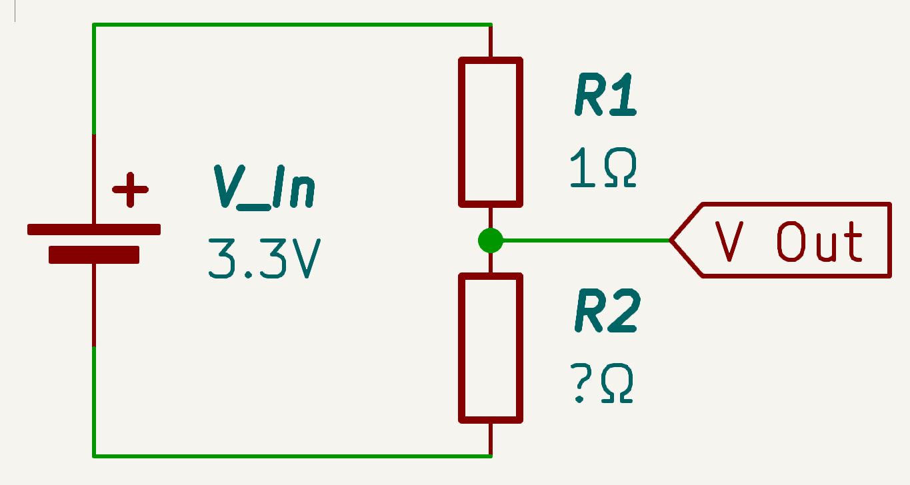

## May 31st: Initial Research & Component Selection

I began by re-reading the FIE (International Fencing Federation) documentation on the material requirements of each weapon and confirm details such as signaling information and the permitted resistances of each component. Because fencing has three main weapons, there are three different signaling protocols the device must be able to test. However, much of the physical connectors and pinouts is shared between weapons and as such I am hopeful that it will be possible to limit the need for separate testing hardware through use of a microcontroller to switch inputs, etc.

The function of testing equipment will be primarily served through measurement of resistance across components leading to a pass/fail result based on comparison to the standards. However, I also intend to add an option to select a weapon and then have weapon testing including hit detection and on/off target detection. This will require additional ports and can be self contained within the unit. Finally, I am also investigating the ability to send test signals to other score machines. Because voltages are not standardised between units, this would require implementation of a set of relays to close the connections from the external unit.

### Control Requirements

The unit will require a microcontroller to register the test inputs and generate sample outputs. This will likely be an esp32 derived controller selected further on once requirements are better established.

As there is intent to extend functionality to generating test signals for external equipment a series of relays will be required. This is because fencing computers do not all operate at a standard logic level for piste signals, with significant variation between devices. However, most devices use a voltage of around 0.75V to 1V so relays and other switching components can be designed around this low range - potentially using 3.3V rated components to provide a safe margin of error.

### Hardware interface

The hardware interfaces of the device are influenced by the definitions within the FIE technical documentation. This provides a unified system for connectors and pinouts across equipment globally.

Choices regarding the interfaces are centered around trying to provide as much functionality as possible, but will change over time as the project implementation evolves.

Interfaces that are likely required for the device include:

Weapon & Fencer Interfaces

- Body wire connector - 3 Pin Banana Plug (FIE)
- Eppe weapon connector - 3 Pin Banana Plug (FIE)
- Foil/sabre weapon connector - 2 Pin Banana Plug (FIE)
- Ground tab - strip of metal to attach lame clip

User Interfaces

- Weapon Selection
- Mode Cycle
- Screen - For output of test information & manual test feedback

External Box Test Interfaces

- 3 Pin Banana Plug (FIE) output port to test external hit machines

**Total time spent: 3h**

## June 1st: Research into individual weapon checks

I continued researching how to best implement the tests on individual weapons. The key requirements of this testing mode must include:

### Validation of resistance

While fairly simple, all equipment has specific resistance ratings that it must remain under to perform properly. If there is any increase in resistance due to rust or microscopic fractures, it can lead to the incorrect detection of a hit. This often manifests through weapons registering as off target in foil or false hits in eppe. By checking these factors, it is possible to diagnose a broken/worn out tip or a poor body wire connection (often stemming from collapsed plugs).

Required maximum resistances are:

- The body wire must have a resistance of 1 ohm
- The spool must have a resistance of 3 ohms
- Weapon resistance of 2 ohms
- Cable resistance of 2.5 ohms

### Hit registration

In order to test that weapons are wired correctly, it must be possible to check continuity between the wires going to the button. This allows verification that hits will register. For foil and sabre, it is also necessary to check continuity to the jacket of the opponent. This is because foil and sabre only register 'valid' hits on a specific section of the body and all other hits must be registered as a separate off-target signal.

Within documentation, each pin of the standard connector is only referred to by its distance from the centre. I will define pinout numbers for them to simplify the creation of documentation and schematics throughout this project.

#### Pin Usage

| Weapon | Pin 1 | Pin 2 | Pin 3 |
| ------ | ----- | ----- | ----- |
| Foil   | Lame | Tip | Weapon/Piste |
| Eppe   | Direct Wire | Other Wire | Weapon/Piste |
| Sabre  | Lame | Tip | Weapon/Piste |

#### Hit detection

The criteria for registering a hit differ between weapons.

In foil and sabre, pins 2 & 3 must be closed on the weapon, and Pin 2 must be connected to the opponents pin 1 (Via the opponents conductive jacket). If pins 2 & 3 are closed but the circuit through the opponent's jacket is not completed it is counted as 'off-target'. In this case no point is awarded, but the bout must still be halted and so it must be detectable and displayed. Foil and sabre have all connections normally open.

In eppe pins 1 & 2 are normally closed, and a hit is registered when the connection is opened. Because eppe does not have a target area, Pin 3 is used to detect connection to the floor or opponents weapon. If the weapon hit the floor instead of the opponent, the hit will not register.

### Implementation of hit detection

Hit detection will be implemented with a single 3 pin connector attached to the body wire and weapon. By raising pin 2 to high and connecting pins 1 & 3 to input ports on the microcontroller, it is possible to check which circuits are complete and thus register a hit in testing. In order to have this adapt to the different weapons, a weapon select button will be required to change the logic between foil, eppe, and sabre.

In order to correctly identify target/vs off target for foil and eppe, it will be necessary to include a metal tab that simulates the connection to the lame.

### Implementation of resistance checking

Resistance checking is a key feature in troubleshooting. However, implementing it with minimal components is challenging. Because of this, I have decided to limit resistance checking to just the body wire. I believe this is reasonable to prevent score creep and because these are the most commonly troubleshooted components. Since this gives us a very small range of resistance, it will be simple to include a voltage divider that compares if the wire is over the set legal resistance value with a comparison resistor. Having a small range of resistances that are being tested also removes the key issue of using a voltage divider which is that they get increasingly inaccurate as you move away from the known comparison value.

### Implementation of test signal output

In order to test external equipment capable of running matches with precise FIE certified timings, it is also necessary to add a signal generator. This can be managed by plugging a 3 pin into a strip and using relays to close/open the pins depending on the selected weapon. Relays are required as there is no standardised voltage that boxes operate on and some use more advanced ground separation between the fencers to prevent issues with foil. However, the relays can be rated for only a couple of volts as must boxes use fairly low logic levels.

### Hardware for the test signal output

Because of the variability of fencing boxed, the relays need to be bi-directional DC. This eliminates SSRs from being an option. Realistically, I need 3 SPST relays with a 3.3V coil level and a low voltage low current load. From this, I have moved towards using miniature mechanical relays but need to decide what pole type to use - DPDT and SPDT relays are often more common and depending on the component are cheaper than low quantity SPST.

As a result of these factors I have decided on the G6K as the relay for this project - specifically the G6K-2P-Y (through hole) as I cannot mount surface mount components at the moment and do not plan on getting PCB assembly (this may change after i select the microcontroller). This will require the addition of a transistor to prevent the risk of overloading the GPIO pins and a blowback diode. After completing a relay module the schematic looks like this:

Adding in the connections for both foil and eppe along side a connection to the opponents lame it looks something like this:

### BOM

I have begun putting the components from the schematic so far into the BOM. I have tried my best to get accurate prices but they may be a bit off due to USD exchange rate.

The main thing I am unsure of is sourcing - particularly given the request to go through the cheapest supplier. This is a request I fully agree with but am unsure of how to best implement. Aliexpress has far cheaper prices per unit for like 100pcs but since I only need three getting it for a much worse price from a supplier within australia (who is renowned for having bad unit prices) ends up being slightly cheaper (around USD0.50) to buy 3pcs relative to the 100pcs on Aliexpress.

**Total time spent: 4h**

## June 3rd: Component research, new schematics

I continued researching suppliers for some of the components I am using. I have also continued developing the schematic for the resistance measurements. Furthermore, I worked on implementing the internal weapon tester. The internal tester will allow this to be used to check wiring of a weapon. While full competition boxes can be used for this weapon testing functionality, a unit will normally set you back a couple of thousand dollars meaning that incorporating this function into a smaller, more portable, and cost efficient package will be a valuable tool for diagnosis and performing repairs away from the piste.

### Resistance Checker

Previously, I settled on using a voltage divider based system to measure the resistance of components. This was because of the small form factor, low cost, and reduced complexity - especially when administrating a pass/fail against a set value.

The feature will focus on testing the body wire as it is the most common and exposed point of failure. This means it is a simple pass/fail to check the resistance is under one ohm. To get the result, a 1 ohm resistor will be places parallel to the wire and the proportion of voltage that takes the wire path can be used to calculate the resistance. A 1 ohm resistor is chosen for reference as the closer the reference resistor is to the value we are attempting to measure, the more accurate the reading is. This means that while this is not the most accurate way of measuring a wide range of resistances it will be more than sufficient for our purpose of giving a pass/fail with some indication of what the resistance of the body wire could be.

In a voltage divider, the output voltage can be calculated using:
*V*~out~=*V*~in~*R*~2~÷(*R*~1~+*R*~2~)

Since we are measuring the output voltage, we can rearrange the equation to have *R*~2~ as the subject:
*R*~2~=*R*~1~((*V*~in~/*V*~out~)-1)^-1^

Within our system, all other variables are known (provided we use an analogue port to measure *V*~out~):

| Variable | Value |
| -------- | ----- |
| *V*~in~  | 3.3V  |
| *V*~out~ | DIO   |
| *R*~1~   | 1Ω    |
| *R*~2~   | ?Ω    |

To achieve this, the circuit will look something like this:

However, one important thing to note is that R2 will be out body wire. As such it will actually be connected through a series of ports.

When we chain three of them to access all of the wires:

**Total time spent: 2h**