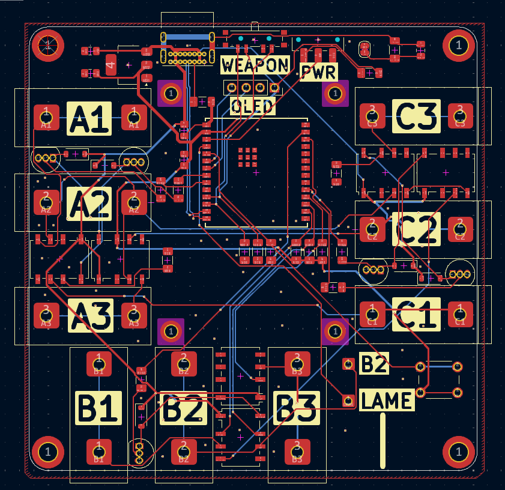
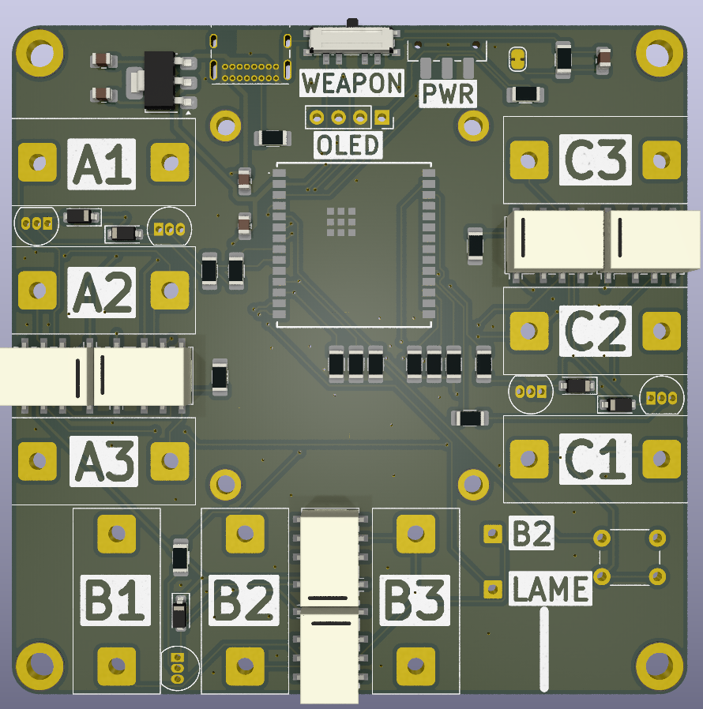

# Fencing Tester

Fencing Tester is a tool for testing and analysing basic fencing equipment. It is intended for situations where you may not have access to a full piste setup to test equipment during repair or when you are tired of manually jabbing a weapon button a hundred times while trying to find which part of a reel/cable set decided to break this time.

It aims to provide basic troubleshooting functionality including:

- Weapon readout for Eppe, Foil & Sabre
- Body wire resistance testing for Eppe, Foil, & Sabre
- Test signal generator for troubleshooting pistes

## Images

### Why did I make this?

I created this project due to an interest in the electrical signaling protocols used in fencing, and fascination with the reliable and intricate mechanisms that make modern blades work. This spiraled into creating a multi-function testing device with signal generation, weapon readout, and wire checking for fun.

## BOM

See BOM.csv for full details

|CATEGORY|ITEM|QUANTITY|
|-------|----|---------|
|COMPONENTS|G6K-2P-Y 5V|6|
||1N4148|5|
||BC547|6|
||10uF Capacitors|2|
||0.1uF/100nF|2|
||1nF Capacitors|1|
||10k Resistor|6|
||510 Resistor|5|
||1 Resistor|3|
||5.1k Resistor|1|
||1M Resistor|1|
||Display 128x128 I2C|1|
||AMS1117-3.3|1|
||Banana Plugs|9|
||3mm Plug|1|
||USB-C Connector|1|
||Pin Headers Female|4|
||Push Button|1|
||2P Switch|1|
||3P Switch|1|
||ESP32-C6-WROOM-1U|1|
|HARDWARE|M4x20 Socket Head|4|
||M2x10 Socket head|4|
|MATERIALS|PLA 1kg|1|
||3mm Sheet|1|
